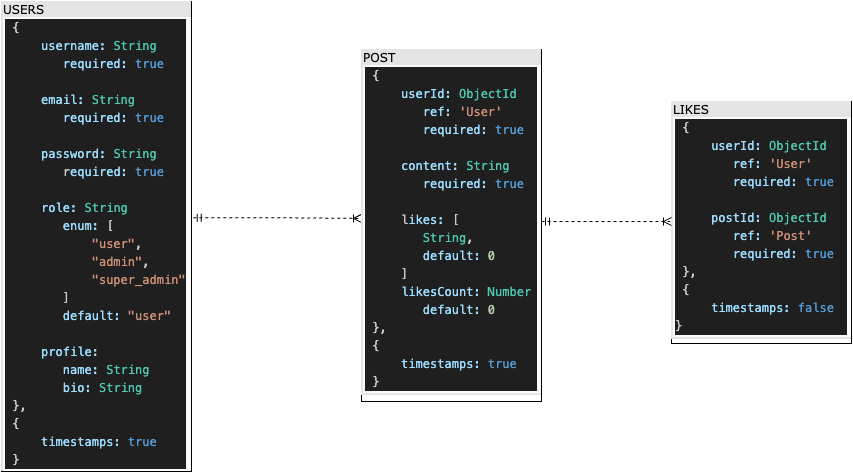

# SOCIAL MEDIA PLATFORM

This is the FIFTH PROJECT of the Full Stack Development Bootcamp with <a href="https://github.com/GeeksHubsAcademy" target="_blank">Geekshubs Academy</a>.


<div align="center">

</div>

<details>
  <summary>Table of Contents</summary>
  <ol>
    <li><a href="#project-description-es">Description (ES)</a></li>
    <li><a href="#challenge">Challenge</a></li>
    <li><a href="#database-diagram">Database diagram</a></li>
    <li><a href="#instalation-local">Instalation</a></li>
    <li><a href="#endpoints">Endpoints</a></li>
    <li><a href="#project-development">Project development</a></li>
    <li><a href="#deployment">Deployment</a></li>
    <li><a href="#author">Author / Contact </a></li>
  </ol>
</details>


## Project description (ES)
##### Backend development of a social network

<details>
  <summary>Read about it</summary>
<br />
<b>Description:</b>

In this technical test, it is expected that you demonstrate all the knowledge you have to tackle the development of a backend. To do this, and since the purpose of this test is to determine your knowledge of JavaScript, Express, Node, and Mongo, you will need to develop a social network where users can register, access the network, and interact. An important aspect to consider is the ability to follow and unfollow other users, as well as leave comments on their profiles or posts.

<b>Functional Requirements:</b>
You will develop a social network where users will register, log in, and publish. For this, at least the following collections will be needed:
- users
- posts

<b>Expected Deliverable:</b>
Once the application's needs have been analyzed, it is expected that you can develop a REST API that serves a series of given endpoints.

<b>Other Required Aspects:</b>

- Seeders for the different collections.
- Middlewares to verify the authorship of the post when editing/deleting it.
- Deployment of the backend code to production.

<b>Super Extra Points:</b>

Users can follow other users (Following), and therefore, a user can have followers (Followers).
</details>


## Challenge
- Create Endpoints (registration, login, CRUD, likes):
- Seeders for users and posts.
- All non-public endpoints with corresponding middlewares.
- Deployment

## Database diagram



## Instalation (local)
1.  Clone this repository
2.  Run ` $ npm install ` in terminal
3.  Connect repository with database 
4.  *Run seeders:  ` $ npm run seed `
5.  Start server:  ` $ npm start ` (for the deployed version)
              or:  ` $ npm run dev `(for local connection)

*You can select the ammount of fake users and posts you want to create modifying variable 'numberOfUsers' when instanciating the seeder functions `runSeeders(numberOfUsers)` from the seeds.js file. 

*Running seeders would firstly erase all entries from database and populate from zero.

## Project development

<details>
  <summary>1. MongoDB - Database Design</summary>
    
-   Analyze the project requirements and decide what is the best data structure for a social network application.
-   Concept design: create a Schema defining collections, their fields, and the relationships between them.
-   Design models considering data storage and possible relations with other the models.
</details>

<details>
  <summary>2. Docker - Setting up MongoDB</summary>

-   Install Docker.
-   Create a container for MongoDB.
> $ docker run -d -p 27017:27017 --name mongo -v mongo-data:/data/db -e MONGO_INITDB_ROOT_USERNAME=root -e MONGO_INITDB_ROOT_PASSWORD=root mongo:latest
-   Access the MongoDB container.
-   Set up a MongoDB client tool like Compass for easier database management.
</details>

<details>
  <summary>3. Express - Creating REST API</summary>

-   Initialize Node.js project: `$ npm init`.
-   Install Express.js: `$ npm install express`.
-   Set up routes, controllers, and middleware for user authentication, profile management, and post handling.
-   Use Mongoose as an ODM (Object Data Modeling) library to interact with MongoDB from Node.js.
</details>

<details>
  <summary>4. Mongoose - Connecting to MongoDB</summary>

-   Create a connection to MongoDB using Mongoose in your Express application.
> $ npm i mongoose --save
-   Define Mongoose schemas for user profiles, posts, likes, etc.
-   Implement CRUD operations using Mongoose methods for data manipulation.
</details>

<details>
  <summary>5. Authentication & Authorization</summary>

-   Implement user authentication using JWT (JSON Web Tokens) for session management.
-   Set up authorization middleware to restrict access to certain routes or resources based on user roles and permissions (i.e. super_admin).
-   Hash passwords securely before storing them in the database (i.e. with bcrypt library).
</details>


<details>
  <summary>6. Seeding</summary>

- In order to check out this project, you'll need to ppopulate the database.

- Follow seeding steps from the <a href="#instalation-local">instalation</a> section:
	> Run seeders:  ` $ npm run seed `
</details>


<details>
  <summary>7. Error Handling</summary>

-   Use try/catch system in all functions to validate user input and control general data intake before processing.
-   Implement specific "error handling middleware" to catch and respond to errors gracefully (i.e. email and password validation).
-   Return appropriate HTTP status codes and error messages in responses.
-	Optionally create "success handling middleware" to refactor functions, improving code readability.
</details>

<details>
  <summary>8. Testing & Debugging</summary>

-   Debug and troubleshoot issues using Thunder Client.
-   Use this tool for API testing and validation during development and also after deployment to check all endpoints work properly.
</details>

<details>
  <summary>9. Deployment</summary>

-   Deploy the application to a cloud platform. In this case it is deployed to Fl0.
</details>


## Endpoints

<details>
<summary>AUTH routes</summary>

-   REGISTER new user
    
        POST https://project5-dev-mzdz.2.ie-1.fl0.io/api/auth/register

    body:
    
    ``` js
        {
		"username": "sergio",
		"email":"sergio@mail.com",
		"password": "123456"
		}
    ```

-   LOGIN user

        POST https://project5-dev-mzdz.2.ie-1.fl0.io/api/auth/login
        
    body (log in as SuperAdmin or as normal User):

    ``` js
        {
		"email":"superadmin@superadmin.com",
		"password": "123456"
		}
    ```
	``` js
        {
		"email":"user@user.com",
		"password": "123456"
		}
    ```
	This would grant you a TOKEN you can use to surpass authorization barriers

</details>
<details>
<summary>USERS routes</summary>

-   GET ALL USERS  (including dinamic query search)

        GET https://project5-dev-mzdz.2.ie-1.fl0.io/api/users
        GET https://project5-dev-mzdz.2.ie-1.fl0.io/api/users?username=AdminUser
		GET https://project5-dev-mzdz.2.ie-1.fl0.io/api/users?email=user@user.com

-	GET USER's OWN PROFILE

    	GET https://project5-dev-mzdz.2.ie-1.fl0.io/api/users/profile

-   UPDATE PROFILE (for the currently logged user)

        PUT https://project5-dev-mzdz.2.ie-1.fl0.io/api/users/profile

    body:

    ```js
        {
		"username": "AnotherName"
		}
    ```

-   UPDATE USER'S ROLE

        PUT https://project5-dev-mzdz.2.ie-1.fl0.io/api/users/:id/role

	body:
	```js
		{
		"role": "user"
		}	
	```

-   DELETE USER BY ID

        DELETE https://project5-dev-mzdz.2.ie-1.fl0.io/api/users/:id
</details>
<details>
<summary>POSTS routes</summary>

-   CREATE A NEW POST

        POST https://project5-dev-mzdz.2.ie-1.fl0.io/api/posts

	body:
	```js
		{
		 "content": "Lorem ipsum dolor sit amet, consectetur adipiscing elit, sed do eiusmod tempor incididunt ut labore et dolore magna aliqua. Ut enim ad minim veniam, quis nostrud ..."
		}	
	```

-   DELETE POST BY ID

        DELETE https://project5-dev-mzdz.2.ie-1.fl0.io/api/posts/:id

-   UPDATE POST BY ID

        UPDATE https://project5-dev-mzdz.2.ie-1.fl0.io/api/posts/:id

	body:
	```js
		{
		"content": "Something else"
		}	
	```
-	GET OWN POSTS

		GET https://project5-dev-mzdz.2.ie-1.fl0.io/api/posts/own

-   GET ALL POSTS

        GET https://project5-dev-mzdz.2.ie-1.fl0.io/api/posts

-	GET POST BY ID

		GET https://project5-dev-mzdz.2.ie-1.fl0.io/api/posts/:id

-	GET POST BY userId

		GET https://project5-dev-mzdz.2.ie-1.fl0.io/api/users/posts/:id


-	LIKE or UNLIKE A POST

		PUT https://project5-dev-mzdz.2.ie-1.fl0.io/api/posts/:id
</details>

<br />
Find here the collection of all endpoints in Thunder Client:

1. You have to open Thunder Client
2. Go to collections
3. Import this file for the local server: 
`./src/HTTP/LOCAL_thunder-collection_P.5_social media_MONGO.json`

	or this other for the deployed version:
`./src/HTTP/DEPLOYMENT_thunder-collection_P.5_social media_MONGO.json`


## Deployment

https://project5-dev-mzdz.2.ie-1.fl0.io/api/healthy


## Author
<div align="center">
<a href = "mailto:a.sergiotorres@gmail.com"></a>
<a href="https://github.com/SergioTorresGarcia" target="_blank"></a> 
</div>

